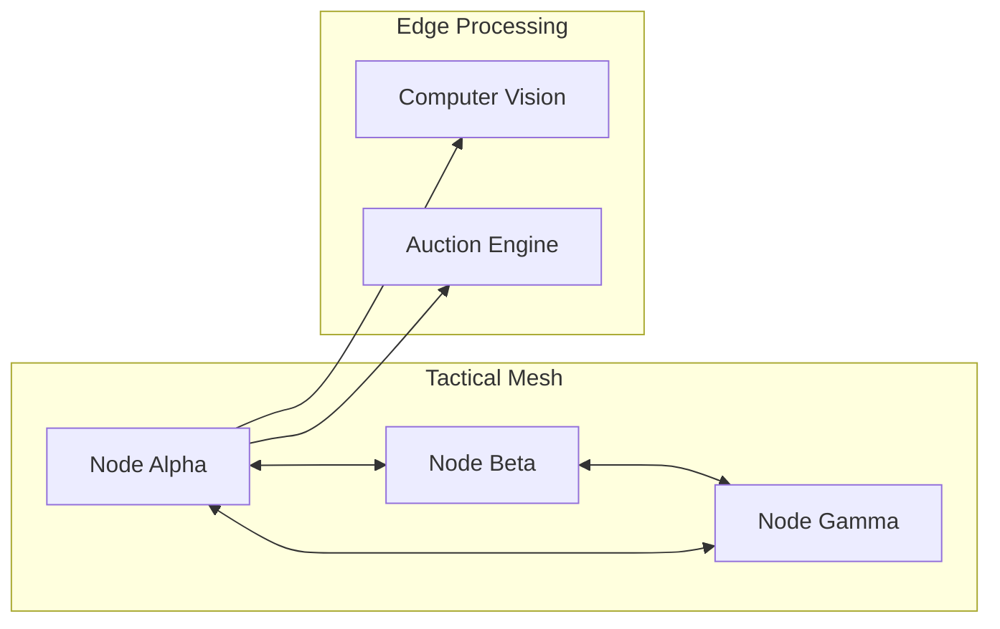

# ⚙️ Project ARES: System Architecture & Protocols

This document details the low-level communication and synchronization protocols that enable decentralized swarm intelligence.

## 1. Mesh Communication Model

### Discovery Protocol (Zero-Conf)
Nodes use **mDNS (Multicast DNS)** over UDP port 5353 for local discovery and **Kademlia DHT** for finding peers outside the immediate L2 segment.

### Gossip Protocol (Data Sync)
To prevent network congestion, ARES uses a **bounded-broadcast gossip protocol**. Each node propagates new intelligence to a subset of its neighbors ($k=3$), ensuring $O(\log N)$ convergence across the entire swarm.

## 2. Distributed Task Allocation (Auction Engine)

The auction follows a 3-step lifecycle:
1.  **Announcement**: An observer node broadcasts a `TaskRequest` packet.
2.  **Bidding**: Available effectors calculate their local cost (Fuel, Ammo, Distance) and send a `BidResponse`.
3.  **Commitment**: The observer selects the lowest cost bidder and broadcasts an `Assignment` packet, locking the task.

## 3. Cryptographic Layer
All packets are encapsulated in **ChaCha20-Poly1305** symmetric encryption. Session keys are established via **Diffie-Hellman (Curve25519)** with periodic rotation to ensure Perfect Forward Secrecy.
